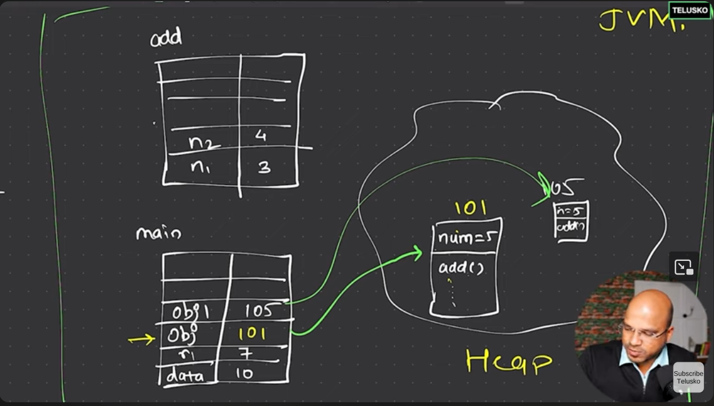

# Java

java is a platform independent language.
unlike cpp it doesn't directly compiles your code to an executable file. .exe file is hardware dependent in cpp.
it compiles your .java file to a bytecode file using JVM(Java virtual machine) which is platform-independent and can be run on any system (windows,linux,mac).
the java compiler is called `jvm`

- JVM (Java virtual machine):
  - class loader : reposible for loading byte code in main memory.
  - memory area : memory allocation
  - Execution Engine-> Interpreter->Jit compiler->garbage collector
- JRE (Java Runtime Environment): JVM + libraries
- JDK (Java Development Kit): JRE + Development tools

To generate the class file (byte code) we can use `javac` compiler

```
javac File.java
```

this will generate the class file with the name File.class and
To run the generated class file we need to do

```
java File
```

We can directly run the java program using the following command

```
java File.java
```

this will generate a `File.class` file which is platform independent and can be run on `JVM` of any machine.

To open the java shell in terminal we use `jshell`

```
jshell
```

## Componenets of Jvm :-

- ### Stack
  - it has two columns and multiple rows.
  - functional variables are stored.
  - when another method is called a new stack is created for it.
- ### Heap
  - here objects are stored. This is allocated at runtime.



#### Example Code.

```java
class Calculator {
  int num = 5; // this is an instance variable **It is a part of Heap Memory**.
  public int add(int n1, int n2){ // the heap memory where the object will be created. will only have the definition of this method.
    System.out.println(num);
    return n1 + n2;
  }
}
public class Demo{
  public static void main(String[] args){
    int data = 10;
    Calculator obj = new Calculator(); // here obj is a reference variable which occupies memory in the main stack and points to the object of Calculator class in the heap memory.
    int r1 = obj.add(3,4);
    System.out.println(r1);
  }
}
```

## Input Output in Java

`System.out.print()`  
`System.out.println()` is used to go to next line after printing.

### Hello World Program

```java
class Hello
{
  public static void main(String[] args){
    System.out.println("Hello World");
  }
}
```

**The file name should be same as the class name.**

## Data Types

- ### Primitive Types

  1. Integer - byte _(1 byte-> -128 to 127)_, short (2 byte), int (4 bytes) , long (8 bytes). [<font color='red'>_by default a integer value `5` is int. If we want to declare it as long we need to write `5l`_</font>]
     ```java
     long n = 5l;
     ```
     If we try to assign int value to a byte it will take modulo with byte range.
     ```java
     byte b = 257;
     ```
     Output:
     ```
     1
     ```
  2. Float - double (8 bytes), float (4 bytes) [<font color='red'>_by default `5.8` will be double. If we want to declare it as float we need to write `5.8f`_</font>]
     ```java
     float n = 5.8f;
     double d = 5.8;
     ```
  3. Character - char (2 bytes) [<font color='green'>_it supports unicode rather than ASCII-> so it supports all the characters. While in other languages we have ASCII (1 byte)._</font>]

  4. Boolean - boolean [<font color='red'>In java, `0` and `1` are not considered as `false` and `true`. It is only `true` or `false`.</font>]
     ```java
     boolean b = true;
     boolean b = 0; // this is wrong. it will throw error.
     ```

### Literals

- To write a number in `binary`, you can use `0b` prefix. Here is an example
  ```java
  int num = 0b1010;
  System.out.println(num);
  ```
  Output:
  ```
  10
  ```
- To write a number in `hexadecimal`, you can use `0x` prefix. Here is an example
  ```java
  int num = 0x7E;
  System.out.println(num);
  ```
  Output:
  ```
  126
  ```
- In Java, you can also use `'_'` to separate the digits. So that it's easy to count.
  Here is an example,
  ```java
  int num = 1_00_00_000;
  System.out.println(num);
  ```
  Output:
  ```
  10000000
  ```

### Type Casting - (Explicit conversion)

```java
int a = 24;
byte k = (byte)a;
```

### Type Promotion

```java
byte a = 10;
byte b = 30;
int res = a*b;      // a*b is out of bounds of byte it gets promoted to int.
System.out.println(res);
```

### Switch Case

Old way of writing switch cases. **It Still Works**

```java
switch (){
  case 0:
    //
    break;
  case 1:
    break;
}

```

## Object Oriented Programming.

#### Class

- Class is basically the blueprint of an object. It has some properties and methods.

#### New way of writing switch cases introduced in Java 8. We don not need to write `break` in every case.

```java
String day = "Sunday";
switch (day) {
    case "Saturday", "Sunday" -> {
        System.out.println("Saturday");
        System.out.println("Sunday");
    }
    case "Monday" -> System.out.println("Monday");
    default -> System.out.println("day");
  }
```

We can even use Switch Case to return a value.

```java
String day = "Sunday";
String result = switch (day) {
    case "Saturday", "Sunday" -> "6am";
    case "Monday" -> "8am";
    default -> "7am";
};
System.out.println(result);
```

## Arrays

- In Java, Arrays are objects of Object class.
- It is allocated heap memory.
- It can be declared like `int arr[] = new int[size]` , `String arr[] = new String[size]`.
- Index starts from 0 and they are stored at consecutive memory locations.
- They are always created at runtime.
- #### Advantages
  - It can store mutliple values.
  - Primitive type to wrapper classes object conversion will not happen so it is fast.
- #### Disadvantages
  - Size is fixed we can't change it in runtime.
  - chances of memory wastage.
  - Only simmilar data types can be stored.
- #### Declaration
  - `int[] a`, `int []a`, `int a[]` all are valid declarations but most preferred is `int[] a`.
  - `int[] a,b` => both a and b are arrays.
  - `int []a,b` => both a and b are arrays.
  - `int a[],b` => a is array but b is a integer variable.\*
  - we can't declare size at the time of declaration like this:
    `int [3]a` => error.
- #### Jagged Arrays

  - We can create 2D arrays with different sizes of individual arrays.

  ```java
  int nums[][]=new int[3][]; // jagged array
  // here we have not mentioned the (size of the 1D arrays/ columns in reach row).
  // the size of nums[0] will be not defined as it is null.
  // we can allocate the different number of columns to each row.
  nums[0] = new int[4]; // 0th row have 4 columns.
  nums[1] = new int[7]; // 1st row have 7 columns.
  ```

## Inbuilt Methods

- `Math.random()`

  It Gives random double values between 0 and 1.

  ```java
  int rand = Math.random();

  ```
